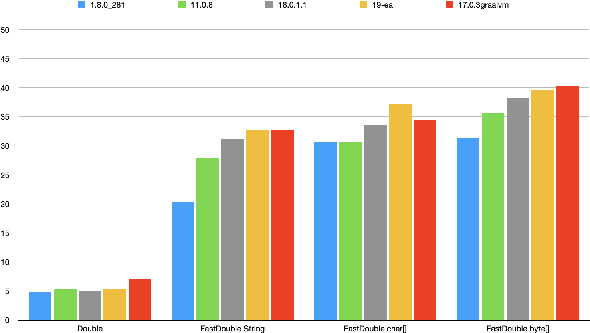

# FastDoubleParser

This is a Java port of Daniel Lemire's fast_double_parser.

https://github.com/lemire/fast_double_parser

Usage:

    import ch.randelshofer.fastdoubleparser.FastDoubleParser;
    import ch.randelshofer.fastdoubleparser.FastFloatParser;

    double d = FastDoubleParser.parseDouble("1.2345");
    float f = FastFloatParser.parseFloat("1.2345");

Method `parseDouble()` takes a `CharacterSequence`. a `char`-array or a `byte`-array as argument. This way. you can
parse from a `StringBuffer` or an array without having to convert your input to a `String`. Parsing from an array is
faster. because the parser can process multiple characters at once using SIMD instructions.

When you clone the code repository from github. you can choose from the following branches:

- `main` The code in this branch requires Java 17.
- `java8` The code in this branch requires Java 8.
- `dev` This code may or may not work. This code uses the experimental Vector API that is included in Java 17 and 18.

How to run the performance tests on a Mac:

1. Install Java JDK 8 or higher. for example [OpenJDK Java 18](https://jdk.java.net/18/)
2. Install the XCode command line tools from Apple.
3. Open the Terminal and execute the following commands:

Command sequence for Java 17 or higher:

     git clone https://github.com/wrandelshofer/FastDoubleParser.git
     cd FastDoubleParser 
     javac -d out -encoding utf8 --module-source-path src/main/java --module ch.randelshofer.fastdoubleparser    
     javac -d out -encoding utf8 -p out --module-source-path FastDoubleParserDemo/src/main/java --module ch.randelshofer.fastdoubleparserdemo
     java -p out -m ch.randelshofer.fastdoubleparserdemo/ch.randelshofer.fastdoubleparserdemo.Main  
     java -p out -m ch.randelshofer.fastdoubleparserdemo/ch.randelshofer.fastdoubleparserdemo.Main data/canada.txt   

Command sequence for Java 8 or higher:

     git clone https://github.com/wrandelshofer/FastDoubleParser.git
     cd FastDoubleParser 
     git checkout java8
     mkdir out
     javac -d out -encoding utf8 -sourcepath src/main/java/ch.randelshofer.fastdoubleparser src/main/java/ch.randelshofer.fastdoubleparser/**/*.java    
     javac -d out -encoding utf8 -cp out -sourcepath FastDoubleParserDemo/src/main/java/ch.randelshofer.fastdoubleparserdemo FastDoubleParserDemo/src/main/java/ch.randelshofer.fastdoubleparserdemo/**/*.java
     java -cp out ch.randelshofer.fastdoubleparserdemo.Main  
     java -cp out ch.randelshofer.fastdoubleparserdemo.Main data/canada.txt   

On my Mac mini (2018) I get the results shown below. The speedup factor with respect to `Double.parseDouble` ranges from
0.5 to 6 depending on the shape of the input data. You can expect a speedup factor of 4 for common input data shapes.

    WARNING: Using incubator modules: jdk.incubator.vector
    Intel(R) Core(TM) i7-8700B CPU @ 3.20GHz SIMD-256
    x86_64. Mac OS X. 12.4. 12
    OpenJDK 64-Bit Server VM. Oracle Corporation. 19-ea+33-2224
    -XX:+UnlockExperimentalVMOptions
    
    parsing random doubles in the range [0.1)
    Trying to reach a confidence level of 99.8 % which only deviates by 1 % from the average measured duration.
    FastDouble String :   508.40 MB/s (+/- 1.7 %)    29.18 Mfloat/s      34.27 ns/f
    FastDouble char[] :   607.34 MB/s (+/- 4.9 %)    34.86 Mfloat/s      28.68 ns/f
    FastDouble byte[] :   667.66 MB/s (+/- 2.2 %)    38.32 Mfloat/s      26.09 ns/f
    BigDecimal        :    56.77 MB/s (+/- 4.0 %)     3.26 Mfloat/s     306.90 ns/f
    Double            :    97.33 MB/s (+/- 3.6 %)     5.59 Mfloat/s     178.98 ns/f
    FastFloat  String :   521.30 MB/s (+/- 3.3 %)    29.92 Mfloat/s      33.42 ns/f
    FastFloat  char[] :   631.92 MB/s (+/- 8.6 %)    36.27 Mfloat/s      27.57 ns/f
    FastFloat  byte[] :   671.79 MB/s (+/- 5.4 %)    38.56 Mfloat/s      25.93 ns/f
    Float             :   103.80 MB/s (+/- 3.5 %)     5.96 Mfloat/s     167.84 ns/f
    
    Speedup FastDouble String vs Double: 5.22
    Speedup FastDouble char[] vs Double: 6.24
    Speedup FastDouble byte[] vs Double: 6.86
    Speedup BigDecimal        vs Double: 0.58
    Speedup FastFloat  String vs Double: 5.36
    Speedup FastFloat  char[] vs Double: 6.49
    Speedup FastFloat  byte[] vs Double: 6.90
    Speedup Float             vs Double: 1.07

'

    parsing numbers in file /Users/Shared/Developer/Java/FastDoubleParser/github/FastDoubleParser/data/canada.txt
    read 111126 lines
    Trying to reach a confidence level of 99.8 % which only deviates by 1 % from the average measured duration.
    FastDouble String :   430.24 MB/s (+/- 0.8 %)    24.72 Mfloat/s      40.45 ns/f
    FastDouble char[] :   512.85 MB/s (+/- 7.0 %)    29.47 Mfloat/s      33.93 ns/f
    FastDouble byte[] :   515.65 MB/s (+/- 4.2 %)    29.63 Mfloat/s      33.75 ns/f
    Double            :    87.33 MB/s (+/- 4.0 %)     5.02 Mfloat/s     199.27 ns/f
    FastFloat  String :   401.35 MB/s (+/- 1.6 %)    23.06 Mfloat/s      43.36 ns/f
    FastFloat  char[] :   552.98 MB/s (+/- 4.9 %)    31.78 Mfloat/s      31.47 ns/f
    FastFloat  byte[] :   555.85 MB/s (+/- 1.7 %)    31.94 Mfloat/s      31.31 ns/f
    Float             :   103.38 MB/s (+/- 4.1 %)     5.94 Mfloat/s     168.33 ns/f

    Speedup FastDouble String vs Double: 4.93
    Speedup FastDouble char[] vs Double: 5.87
    Speedup FastDouble byte[] vs Double: 5.90
    Speedup BigDecimal        vs Double: 0.61
    Speedup FastFloat  String vs Double: 4.60
    Speedup FastFloat  char[] vs Double: 6.33
    Speedup FastFloat  byte[] vs Double: 6.37
    Speedup Float             vs Double: 1.18

FastDoubleParser also speeds up parsing of hexadecimal float literals:

    parsing numbers in file /Users/Shared/Developer/Java/FastDoubleParser/github/FastDoubleParser/data/canada_hex.txt
    read 111126 lines
    Trying to reach a confidence level of 99.8 % which only deviates by 1 % from the average measured duration.
    FastDouble String :   406.00 MB/s (+/- 8.9 %)    22.26 Mfloat/s      44.92 ns/f
    FastDouble char[] :   631.42 MB/s (+/-11.6 %)    34.62 Mfloat/s      28.88 ns/f
    FastDouble byte[] :   618.98 MB/s (+/- 2.0 %)    33.94 Mfloat/s      29.46 ns/f
    Double            :    52.61 MB/s (+/- 7.3 %)     2.88 Mfloat/s     346.70 ns/f
    FastFloat  String :   410.53 MB/s (+/-10.2 %)    22.51 Mfloat/s      44.43 ns/f
    FastFloat  char[] :   628.19 MB/s (+/-12.0 %)    34.44 Mfloat/s      29.03 ns/f
    FastFloat  byte[] :   615.30 MB/s (+/- 8.4 %)    33.74 Mfloat/s      29.64 ns/f
    Float             :    53.78 MB/s (+/- 4.0 %)     2.95 Mfloat/s     339.15 ns/f
    
    Speedup FastDouble String vs Double: 7.72
    Speedup FastDouble char[] vs Double: 12.00
    Speedup FastDouble byte[] vs Double: 11.77
    Speedup FastFloat  String vs Double: 7.80
    Speedup FastFloat  char[] vs Double: 11.94
    Speedup FastFloat  byte[] vs Double: 11.70
    Speedup Float             vs Double: 1.02

## Comparison of JDK versions

The Y-axis shows Mfloat/s.

|Method            |1.8.0_281|11.0.8|18.0.1.1|19-ea|17.0.3graalvm|
|-------------------|---|---|---|---|---|
|Double            |4.86|5.34|5.09|5.28|6.96|
|FastDouble String |20.30|27.83|31.18|32.59|32.74|
|FastDouble char[] |30.60|30.68|33.58|37.20|34.32|
|FastDouble byte[] |31.29|35.61|38.24|39.67|40.21|

## Comparison with C version

For comparison. here are the test results
of [simple_fastfloat_benchmark](https://github.com/lemire/simple_fastfloat_benchmark)  
on the same computer:

    version: Thu Mar 31 10:18:12 2022 -0400 f2082bf747eabc0873f2fdceb05f9451931b96dc

    Intel(R) Core(TM) i7-8700B CPU @ 3.20GHz SIMD-256

    $ ./build/benchmarks/benchmark
    # parsing random numbers
    available models (-m): uniform one_over_rand32 simple_uniform32 simple_int32 int_e_int simple_int64 bigint_int_dot_int big_ints 
    model: generate random numbers uniformly in the interval [0.0.1.0]
    volume: 100000 floats
    volume = 2.09808 MB 
    netlib                                  :   317.31 MB/s (+/- 6.0 %)    15.12 Mfloat/s      66.12 ns/f 
    doubleconversion                        :   263.89 MB/s (+/- 4.2 %)    12.58 Mfloat/s      79.51 ns/f 
    strtod                                  :    86.13 MB/s (+/- 3.7 %)     4.10 Mfloat/s     243.61 ns/f 
    abseil                                  :   467.27 MB/s (+/- 9.0 %)    22.27 Mfloat/s      44.90 ns/f 
    fastfloat                               :   880.79 MB/s (+/- 6.6 %)    41.98 Mfloat/s      23.82 ns/f 

    OpenJDK 19-ea+33-2224
    FastDouble String                       :   508.40 MB/s (+/- 1.7 %)    29.18 Mfloat/s      34.27 ns/f
    FastDouble char[]                       :   607.34 MB/s (+/- 4.9 %)    34.86 Mfloat/s      28.68 ns/f
    FastDouble byte[]                       :   667.66 MB/s (+/- 2.2 %)    38.32 Mfloat/s      26.09 ns/f
    BigDecimal                              :    56.77 MB/s (+/- 4.0 %)     3.26 Mfloat/s     306.90 ns/f
    Double                                  :    97.33 MB/s (+/- 3.6 %)     5.59 Mfloat/s     178.98 ns/f

'

    $ ./build/benchmarks/benchmark -f data/canada.txt
    # read 111126 lines 
    volume = 1.93374 MB 
    netlib                                  :   337.79 MB/s (+/- 5.8 %)    19.41 Mfloat/s      51.52 ns/f 
    doubleconversion                        :   254.22 MB/s (+/- 6.0 %)    14.61 Mfloat/s      68.45 ns/f 
    strtod                                  :    73.33 MB/s (+/- 7.1 %)     4.21 Mfloat/s     237.31 ns/f 
    abseil                                  :   411.11 MB/s (+/- 7.3 %)    23.63 Mfloat/s      42.33 ns/f 
    fastfloat                               :   741.32 MB/s (+/- 5.3 %)    42.60 Mfloat/s      23.47 ns/f 

    OpenJDK 19-ea+33-2224
    FastDouble String                       :   430.24 MB/s (+/- 0.8 %)    24.72 Mfloat/s      40.45 ns/f
    FastDouble char[]                       :   512.85 MB/s (+/- 7.0 %)    29.47 Mfloat/s      33.93 ns/f
    FastDouble byte[]                       :   515.65 MB/s (+/- 4.2 %)    29.63 Mfloat/s      33.75 ns/f
    Double                                  :    87.33 MB/s (+/- 4.0 %)     5.02 Mfloat/s     199.27 ns/f
